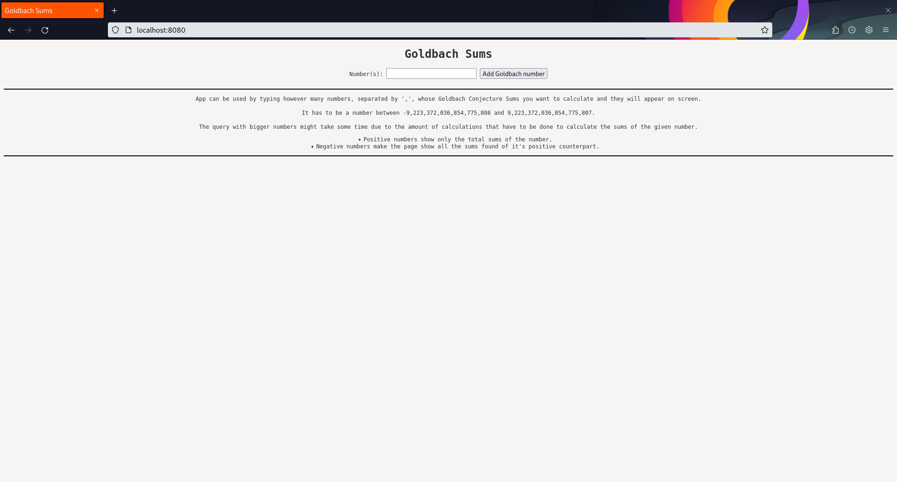
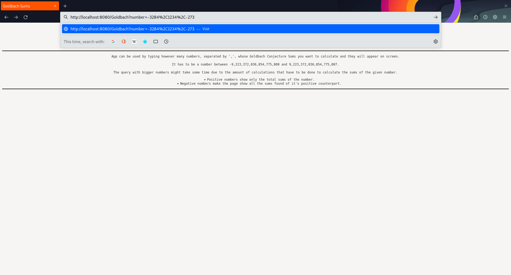
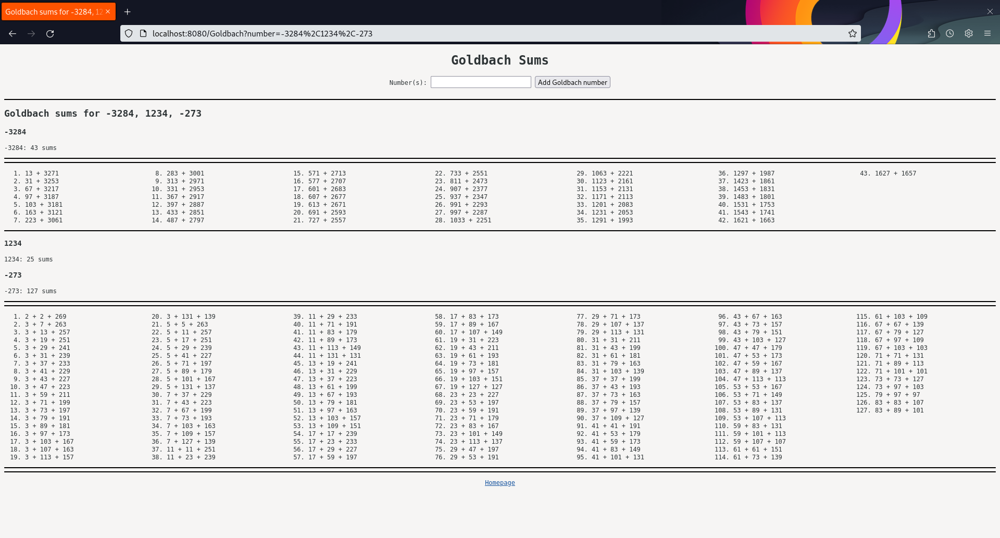
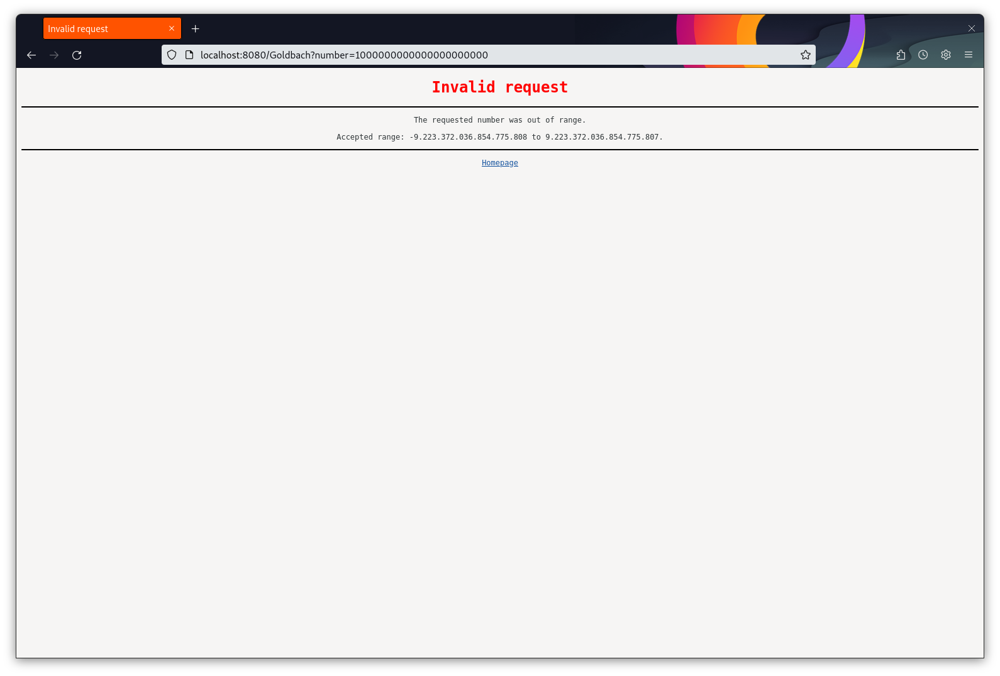

# Project 1.1 Concurrent Server

- Author: A. Badilla Olivas, Student ID: B80874
- Author: B. Mora Umaña, Student ID: C15179
- Author: G. Molina Bulgarelli, Student ID: C14826
- Author: J.A. Madriz Aguero, Student ID: C14394

## Assigment Description

The challenge for the team in this particular project is to turn the provided serial web server into a connection concurrent one, so that it can naturally serve multiple client connections at the same time. Note that this enhancement only changes the server code and not the web applications performance in itself. The only web application implemented so far is a singleton of a Goldbach Conjecture. These web benefit from server concurrency even though the applications remain serial.

## User manual

To start the local web server, it has to be compiled in the terminal of your choice with the command along with the Makefile provided:
```make```

and then it can be executed with the command:
```bin/project1.1```

The program can also be compiled and run all at once with the command:
```make run```

Once it's running, it can be shut down with the key combination:
```CTRL-C```

To access the local web server, the connection has to be opened with a web navegator with:
```localhost:8080```

## Webpage

Once the local web server is opened, it can be used by typing however many numbers the user wants to calculate and it will appear on screen. 

It has to be a number between -9,223,372,036,854,775,808 and 9,223,372,036,854,775,807.

The query with bigger numbers might take some time due to the amount of calculations that have to be done to calculate the sums of the given number.

- Positive numbers show only the total sums of the number.
- Negative numbers make the page show all the sums found of it's positive counterpart.

## Homepage



## Search number by URI



## Display sums of various numbers



## Out of range input

