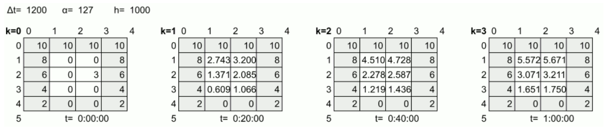
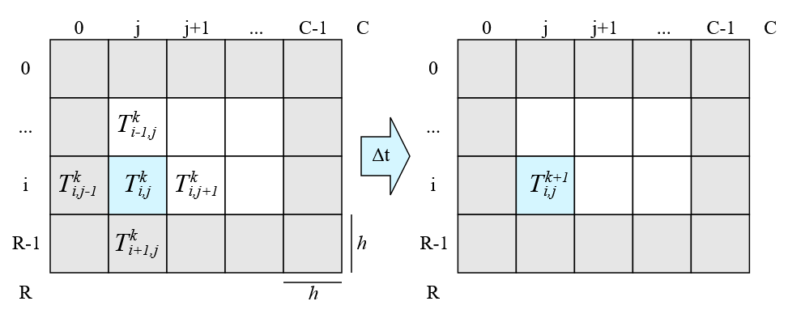

# Project 2 Heat Tranfering Simulation

- Author: A. Badilla Olivas, Student ID: B80874
- Author: B. Mora Umaña, Student ID: C15179
- Author: G. Molina Bulgarelli, Student ID: C14826
- Author: J.A. Madriz Aguero, Student ID: C14394

## Assigment Description

A simple computer simulation is needed to help find the thermal equilibrium momentum of a rectangular plate injected with constant heat at its edge. The plate corresponds to a two-dimensional rectangle of the same material. For simulation purposes, the rectangle is divided into R rows and C columns both of equal height and width h as shown below This generates a matrix whose cells are all square, of width and height h.

<center>



**_Figure 1_** _Heat Simulation_

</center>

Each cell of the matrix stores a temperature, which can change over time. The notation $`T_{i,j}^k`$ is used to indicate the temperature of the cell located in row i, column j, at instant or state k. After a time Δt has elapsed, the simulation will go from instant k to instant k+1, and the temperature in the sheet will have changed (state). As is known, energy is transferred from a hotter area to a colder one. The new temperature in cell i,j will be $`T_{i,j}^{k+1}`$ as seen on the right side of Figure 1, and can be estimated from its temperature at the previous instant (or state) and the temperature of its neighboring cells by the relation:

$`T_{i,j}^{k+1} = T_{i,j}^k + \frac{\Delta t \cdot \alpha}{h^2} (T_{i-1,j}^k + T_{i,j+1}^k + T_{i+1,j}^k + T_{i,j-1}^k - 4T_{i,j}^k)`$

According to the above relationship, the temperature of a cell at instant or state k+1 indicated by Tk+1i,j, is the result of the temperature that the cell had at the previous instant or state Tki,j plus the energy loss or gain that the cell has suffered with its surroundings during that period Δt. For the purpose of the simulation, the vicinities are the four neighboring cells in the shape of a cross as seen in Figure 1. This energy or heat transfer is governed by:

1. The energy that cell i,j receives from its vicinity, and is calculated as the sum of the temperatures of the four neighboring cells $`T_{i-1,j}^k + T_{i,j+1}^k + T_{i+1,j}^k + T_{i,j-1}^k`$

2. The energy that the cell loses and is distributed to its four neighboring cells, calculated as $`-4T_{i,j}^k`$

3. The transfer is not instantaneous, but depends on the area it travels over. The larger the area of the cell, the more time the energy will require to move and equilibrate with its neighbors. Therefore, the energy gain and loss calculated in the previous two points is divided by the area of the cell h2

4. The amount of energy transferred is proportional to time. That is, the more time Δt
is allowed between state k and state k+1, the more energy the cell will be able to exchange with its neighbors. Therefore, the energy exchange calculated in the previous points is multiplied by the duration of the state Δt.

5. The amount of energy exchanged in the time period depends on the conductive quality of the sheet. Materials such as wood are slow to transmit energy, while metals are efficient for this purpose. To reflect this reality, the energy exchange calculated in the previous points is multiplied by the thermal diffusivity, which corresponds to a constant α that indicates at what rate the material manages to transmit energy from a hot spot to a cold spot through it. Its units are area over time, as $`\frac{m^2}{s}`$
or $`\frac{mm^2}{s}`$. For example, wood has a diffusivity of about $`0.08\frac{mm^2}{s}`$ while gold has a diffusivity of $`127\frac{mm^2}{s}`$, i.e. gold transfers heat approximately 1500 times faster than wood.

<center>



**_Figure 2_** _Heat Plate Example_

</center>

Figure 2 shows four instants or states of a hypothetical simulation of a gold foil (thermal diffusivity α= $`127\frac{mm^2}{s}`$). For simulation purposes, the foil was divided into 5 rows and 4 columns, whose cells are h=1000mm side, i.e., one meter wide by one meter high.

At state or instant zero (k=0) the simulation loads the matrix of a file that indicates the initial temperatures of each cell of the sheet. It is important to note that the edges of the sheet do not change their temperature over time, since this is the point where the experimenters "inject or withdraw heat". From this figure it can be seen that at the top, heat is injected at a constant temperature of 10 units (Celcius, Farenheit, or Kelvin), and as one moves down the sheet, less heat is provided at the edges.

At each instant or state, the simulation must update the internal cells of the sheet according to the physical model presented in the previous section. At instant or state k=1 kΔt=1200s=20min will have elapsed. As can be seen in Figure 2, the temperatures at the edges remain constant, but the internal cells have acquired energy from the edges, especially the cells at the top. However, cell 2,2 lost energy despite being next to an edge of temperature 6, since three of its neighbors were colder than it in the previous state k=0

In the state k=2, kΔt=2⋅1200s=40min will have elapsed. As can be seen in Figure 2, the internal cells have slowly increased their temperature given that they are 1m^2 each. Even cell 2.2 has seen a reflected increase. In the state k=3 state, which in real life would occur one hour after the experiment starts, the internal temperature is still increasing, but has not yet equilibrated with the edge values.

It is desired that the simulation continues until the equilibrium point has been reached, which occurs when the heat has stabilized in the sheet. For this, an epsilon parameter (ε) will be provided to the simulation, which represents the minimum significant temperature change in the sheet. At each state k all internal cells of the sheet are updated. If at least one of the internal cells has a change in its temperature greater than ε, it indicates that equilibrium has not yet been reached and the simulation continues with the next k+1 state, otherwise it stops and reports the simulation results. For example, if the simulation in Figure 2 were run with a ε=2 temperature units, it would end at state k=2, since the largest temperature change from state k=1 to k=2 occurs in cell 1,1, calculated as |4.51-2.74|=1.77, and is less than the ε=2

The physical model presented in the previous section is very sensitive to the input parameters, and depending on the combination of values may produce incorrect results. The model is closer to reality the more cells are used to represent the sheet (rows and columns) and the smaller the time changes (Δt). However getting closer to reality puts more pressure on the machine resources, which makes the simulation slower, so a parallelized version of the simulation, which can find the thermal equilibrium point in the shortest possible time, is desired.

Design of the solution can be seen in: [Design README](https://git.ucr.ac.cr/ANTHONNY.BADILLA/c_la_vie/-/tree/main/project2.1/design)

There is also a study of the efficiency of the optimizations in the report section: [Report README](https://git.ucr.ac.cr/ANTHONNY.BADILLA/c_la_vie/-/tree/main/project2.1/report)

## User manual

To start a heat simulation, it has to be compiled in the terminal of your choice with the command along with the Makefile provided:
```make``` and then it can be executed with either of the following commands:

- If the user wants a non-distributed OpenMP: ```bin/project2.1 <input file> <#threads>```
with ```input file``` being the path to the job.txt you want to simulate and  ```#thread``` the amount of threads which the job will be worked with during the simulation.

- If the user wants to use an OpenMPI distribution
```mpiexec -np <#processes> --map-by <#distributionType> bin/project2.1 <inputFile> <#threads>```

Once it's running, it can be shut down with the key combination:
```CTRL-C```
