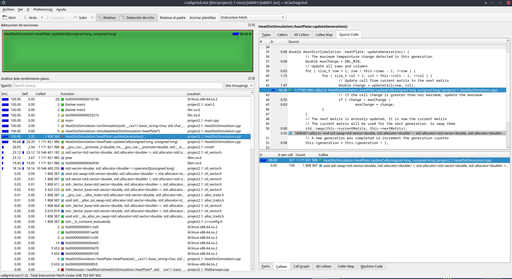
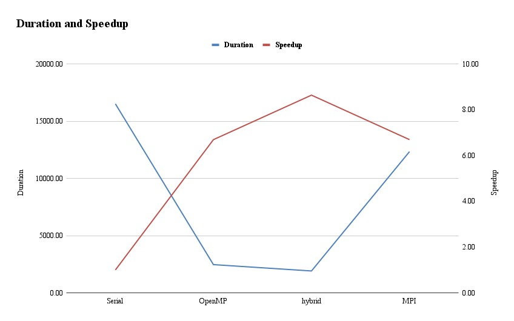
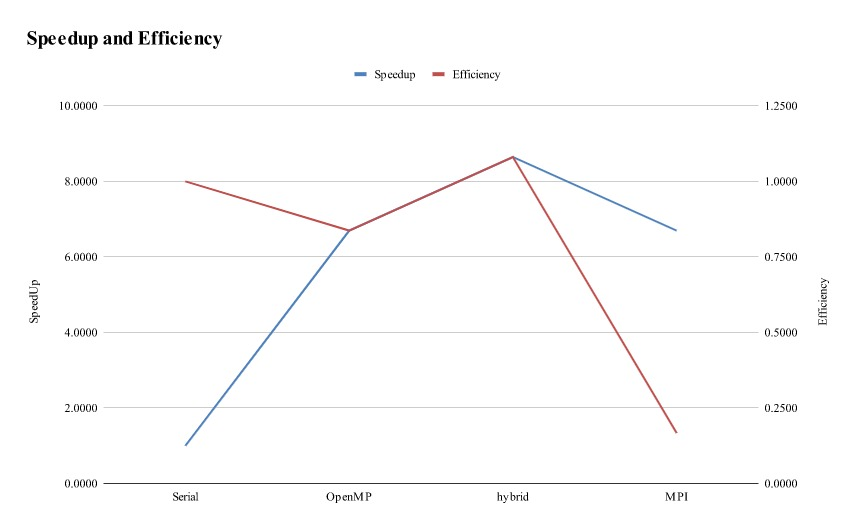

# Report

In view of the long duration of the program, optimizations were sought to shorten the computation time of the entire program.

## Methodology

- The program uses the test cases provided with the program.
- Three measurements were made per case and kept the fastest one, with time measured using perf tools.
- The system did not have any other program which used the memory.
- The Arenal cluster of the ECCI, UCR, was used as the measurement computer.

## Optimizations

Looking at the data analized with Kcachegrind we can observe the longest time is spent calculating the cell changes which cannot be changed as its based on a delicate and specific equation. Hence the need to use OpenMPI distributed usage.

## Times

|   Version           | Duration  |  Speedup | Eficiency |
| :---:                   |  :---:                |  :----:                 |  :----:                 |
|&#124; Serial (1 process, 1 thread) &#124;| 16523.20s | 1.00 | 1.00 |
|&#124; OpenMP (1 process, 8 threads) &#124;| 2467.12s | 6.70 | 0.84 |
|&#124; OpenMPI (24 processes, 1 thread) &#124;| 12347.23s | 6.70 | 0.17 |
|&#124; Hybrid OpenMP/MPI (3 processes, 8 threads) &#124;| 1911.84s | 8.64 | 1.08 |

## Performance Analysis

The speed duration graphic shows that openmp and distributed solutions are faster than the serial version. Specifically the hybrid version (the version which utilizes openmp and mpi to process the plates is the one with the fastest times).  This is because the work units of this specific program consist of plates with matrices. These can be distributed between processes and within the processes the matrix computations can be divided between threads to deal with the work unit. Combining the openmp and mpi gives excellent results and scalability. In this sense there is a strategic resource usage: one can distribute plates across nodes in whatever configuration one might prefer. This reduces overhead because not all machines need to be running all projects, and allows you to use your resources flexibly.

Furthermore, it must be pointed out that regarding the efficiency speed up graph, the best balance between those results will be the results being the openmp and hybrid versions as they better use the resources at their disposal to resolve the problem. It is also important to remark that only using processes is not ideal as even when there are work units (plates) being distributed, each plate will be processed single core. In this sense, hybrid or openmp solutions should be preferred for workloads like this one. In the end, the idea is that many calculations or processes are carried out simultaneously. Large problems can often be divided into smaller ones, which can then be solved at the same time. If this is achieved a great balance between efficiency and speed up will be hit.

